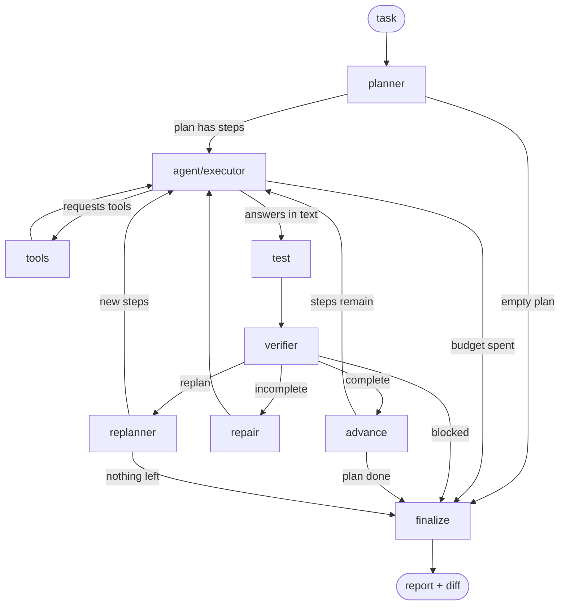

# Fixer

> An autonomous software engineering agent that investigates, repairs, tests, and verifies code changes inside disposable repository copies.

Fixer takes a bug report, plans an investigation, explores the repository with
tools, applies a patch, runs the test suite, and then **verifies whether its own
change actually worked** — repairing or re-planning when the evidence says it
did not. Every run executes in a throwaway copy of the target repository and is
scored by an evaluation harness against tests the agent never sees.

Built with **Python 3.11+**, **LangGraph**, **LangChain**, and **pytest**, with
pluggable model providers (Gemini, Groq, OpenRouter).

**Measured on the included 8-task benchmark** (single architecture,
`autonomous_agent`, 16 scored runs):

| Metric | Result |
| --- | ---: |
| Unique benchmark tasks | 8 |
| Scored runs | 16 |
| Runs resolved (hidden oracle passed) | **11 / 16** |
| Tasks resolved at least once | **7 / 8** |
| Regressions introduced | **0** |
| Runs that exhausted their budget | 4 |
| Runs excluded as provider/API failures | 7 |
| Tool calls per run | median 11 (range 4–29) |
| Wall time per run | median 122 s (range 56–163 s) |

These numbers come from `benchmarks/results.jsonl`. This is an **initial
benchmark of 8 small, purpose-built tasks** — not a SWE-bench-scale evaluation.
Full analysis: [`benchmarks/analysis-2026-09-30.md`](benchmarks/analysis-2026-09-30.md).

---

## Why Fixer?

Asking a model to "fix this bug" produces a patch and stops. Nothing checks
whether the patch applied, whether the tests pass, whether the fix addressed the
cause or just the symptom, or whether the model quietly rewrote the test that was
failing.

Fixer treats those as the actual engineering problem:

```text
Task (bug report)
 ↓
Plan the investigation
 ↓
Inspect the repository with tools
 ↓
Modify code (unified diff)
 ↓
Run the test suite
 ↓
Verify the step against that evidence
 ↓
Repair, or re-plan when evidence contradicts the plan
 ↓
Final report
```

Three properties make this different from a single prompt:

- **The runtime owns the facts, not the model.** The repository path, the test
  environment, and the import path are injected by the graph. The model never
  chooses them, so it cannot get them wrong.
- **Stopping is a claim, not proof.** A separate verifier node decides whether a
  step achieved its objective, using the test result rather than the executor's
  own assertion.
- **The agent is graded on hidden tests.** An earlier version of this agent
  wrote its own passing test file and declared success. The benchmark oracle now
  lives outside the repository the agent can see.

---

## What it does

| Capability | Implementation |
| --- | --- |
| Planning | A planner node emits a structured `Plan` (goal + ordered steps with purpose, expected result, status) via provider-native structured output |
| Repository exploration | 7 LangChain tools: list files, read file, regex search (ripgrep), git diff |
| Code modification | `apply_patch_tool` applies unified diffs with `patch-ng`, returning `applied` / `unchanged` / `failed` / `error` plus the failing hunk |
| Test execution | `run_tests` discovers a working pytest, configures `PYTHONPATH` for `src/` layouts, and classifies results by `status` **and** `phase` (`collection` vs `run`) |
| Verification | A verifier node returns a typed verdict — `complete`, `incomplete`, `replan`, `blocked` — with evidence and missing evidence |
| Repair | A failed step is retried with the verifier's reason and missing evidence named explicitly |
| Re-planning | A contradiction (an observation that invalidates later steps) rewrites the remaining plan, keeping completed work |
| Bounded execution | Per-run iteration and tool-call budgets, per-step retry budget, replan budget; every branch has a terminal path |
| Sandboxing | Each run works in a disposable `git`-initialised copy; the real repository is never modified, and the agent's diff is extracted before teardown |
| Provider abstraction | Gemini, Groq, and OpenRouter behind one `LLM` class, selected by env var, each with its own structured-output method |
| Evaluation | 8 tasks, hidden oracle tests, regression detection, test-tampering flag, JSONL results, no-op baseline, stub-model dry runs |
| Failure isolation | Provider outages are recorded as `infra_error` and excluded from scoring, so API capacity is not charged to the agent |

---

## Architecture

Three architectures share one state object, one tool set, and one provider
layer. Each is a module exposing `build() -> CompiledStateGraph`, registered in
a dict — adding one is a file plus a line.

### `autonomous_agent` — the full loop



| Node | Role |
| --- | --- |
| `planner` | Task → structured `Plan`. Uses a planner-specific role that names no tools, because models that see tool names in a planning prompt try to call them |
| `agent` | Executes exactly one step per turn. Either requests tools or states the step's result in text — the text is the signal that the step is done |
| `tools` | LangGraph `ToolNode`; `repo_path` is injected from state, never supplied by the model |
| `test` | **Deterministic, no model.** Calls `run_tests` directly and records the result, so "did it work" is never the executor's opinion |
| `verifier` | Judges the current step against that step's messages *and* the test result. Returns a typed verdict |
| `advance` | Marks the step complete and resets per-step state so the next step starts clean |
| `repair` | Counts the attempt and sends the step back with the gap named |
| `replanner` | Rewrites the remaining steps after a contradiction, renumbering the whole plan and keeping completed work |
| `finalize` | The only node that reports. Falls back to a locally-composed report if the model is unreachable |

### `simple_planner` — plan and verify, no test node

```text
START → planner → agent ⇄ tools
                    ↓ (no tool call)
                 verifier → advance → agent | finalize
                          ↘ retry (agent)
                          ↘ replan (replanner)
                          ↘ blocked (finalize)
```

Same plan/verify/repair machinery, but the verifier judges a step from the
executor's messages only. Useful for isolating how much the deterministic test
node contributes.

### `react` — the baseline

```text
START → agent ⇄ tools → END
```

One node that thinks and calls tools until it stops. The step order is a
suggestion in the prompt; nothing enforces it. Cheapest to run, and the control
case for whether planning and verification actually help.

### Budgets

| | `react` | `simple_planner` | `autonomous_agent` |
| --- | ---: | ---: | ---: |
| Max iterations | 40 | 20 | 30 |
| Max tool calls | — | 25 | 40 |
| Step retries | — | 2 | 2 |
| Replans | — | 2 | 1 |

These are deliberately **not** equalised yet, which is why the benchmark below
reports one architecture rather than a comparison.

---

## State

A single `AgentState` dataclass flows through every graph
([`fixer/agent/state.py`](fixer/agent/state.py)):

- `messages` with LangGraph's `add_messages` reducer
- `plan` — a `Plan` TypedDict of `PlanStep`s, each carrying `status`
  (`pending → running → completed`)
- `verification` — a Pydantic `VerificationResult`: `verdict`, `reason`,
  `evidence`, `missing_evidence`, `contradiction`, `invalidated_steps`
- `current_step`, `step_start_message_index`, `step_retries`, `replans`,
  `iteration` — the bookkeeping that makes bounded, resumable step execution work
- `files_modified`, `test_results`, `errors`, `status`

`step_start_message_index` is load-bearing: the verifier slices the message
history from there, so evidence from an earlier step cannot be mistaken for
evidence that the current step did its job.

---

## Tools

All seven tools receive `repo_path` through LangGraph's `InjectedState`. It is
absent from the schema the model sees, and any value the model tries to forge is
stripped before execution — so the model only ever supplies repository-relative
paths.

| Tool | Model-visible input | Purpose |
| --- | --- | --- |
| `list_files_tool` | — | Repository layout, relative paths, noise directories filtered |
| `read_file_tool` | `file_path` | File contents (capped at 20,000 characters) |
| `search_code_tool` | `pattern`, `max_results` | Regex search via `ripgrep --json` |
| `git_diff_tool` | — | Uncommitted diff |
| `run_tests_tool` | `test_path`, `timeout` | Runs pytest; owns environment discovery and `PYTHONPATH` |
| `run_command_tool` | `command` (argv list), `timeout` | Escape hatch for anything no specialised tool covers |
| `apply_patch_tool` | `patch` (unified diff) | The only write path into the repository |

Two implementation details worth noting:

- **`run_tests` encapsulates the test environment.** It locates pytest (repo
  virtualenv → current interpreter → `PATH`), puts `src/` on `PYTHONPATH` for
  src-layout projects, and distinguishes a *collection* failure (nothing ran —
  an import or config problem) from a *run* failure (a real assertion). Early
  versions of the agent wasted calls rediscovering this per run.
- **`apply_patch` returns a diagnosis, not a boolean.** `patch-ng` explains which
  hunk failed and what it expected, but only through logging; that output is
  captured and returned so the agent can correct the diff instead of guessing.
  A patch that was already applied reports `unchanged` rather than claiming
  success.

---

## Execution environment

`fixer/sandbox/` defines a `Sandbox` ABC (`create`, `copy_repo`, `run`, `diff`,
`destroy`, plus context-manager support) with one implementation, `LocalSandbox`:

- copies the target repository into a temp directory, excluding `.git`,
  `__pycache__`, `.venv`
- `git init` + baseline commit, so `diff()` returns exactly what the agent
  changed and nothing that was already uncommitted upstream
- the agent reaches the copy because `repo_path` points at it — **no tool needed
  changing** to make runs sandboxed
- `__exit__` always tears the copy down, including when the model API fails
  mid-run

**Honest scope:** this is isolation for *experiments*, not security. Commands
still execute on the host with the user's permissions. What it guarantees is
reproducibility — a pristine copy per run, an untouched source repository, and a
diff as the scoreable artifact. A container-backed `Sandbox` would slot in behind
the same interface; it is not implemented.

---

## Planning, verification, and bounded execution

**Planning.** The planner emits a `Plan` through the provider's structured-output
mechanism, so steps arrive as typed data rather than prose to be parsed. Planning
rules forbid a final "summarise the findings" step — reporting belongs to
`finalize`.

**Execution.** The executor works one step at a time under a contract: it is
responsible for *that step only*, must not execute future steps, must not answer
the overall task, and signals completion by replying in text with no tool call.
The graph routes on that signal, and the prompt states the rule explicitly — a
graph rule the model does not know about is a coin flip.

**Verification.** The verifier sees the step's objective, its expected result,
the messages belonging to that step, the files changed so far, and the test
output. It returns one of four verdicts. A `replan` verdict must name the
contradiction and the invalidated step ids; if it does not, the runtime
downgrades it to `incomplete` rather than trusting the label.

**Contradiction handling.** `replan` means an observation falsified an assumption
that *later* steps depend on — not merely that this step was hard. The verifier
is shown the remaining steps precisely so it can make that judgement, and the
replanner keeps completed work while rewriting what follows.

**Repair.** `incomplete` routes to a repair node that increments the attempt
counter and re-enters the step with the verifier's reason, the missing evidence,
and the latest test output appended as a user turn. Naming the gap matters: a
bare "try again" returns the same turn.

**Bounded execution.** Iteration and tool-call budgets, a per-step retry budget,
and a replan budget. Budget checks are ordered so a run that produced an answer
on its final allowed iteration is not discarded as over-budget. Every verdict and
every router has a path to `finalize`, because a loop that edits files must not
die mid-repair with no report — and if even the final model call fails,
`finalize` composes the report locally from state.

---

## Evaluation framework

`fixer/eval/` — four modules, ~380 lines. Design rationale:
[`benchmarks/EVALUATION.md`](benchmarks/EVALUATION.md).

**Task format.** A task is a directory; adding one requires no code change:

```text
benchmarks/tasks/<name>/
├── task.md          → the prompt the agent receives
├── grade_test.py    → the oracle, never visible to the agent
└── repo/            → optional fixture repo (src/ + tests/)
```

**Hidden oracles.** After a run, `grade_test.py` is copied into `_grading/`
inside the sandbox and pytest runs on that path only. The agent cannot write the
test that grades it. Oracles check *documented* behaviour, not just the reported
symptom — the `tribonacci` oracle verifies the whole sequence, so special-casing
the two values named in the bug report does not pass.

**Metrics recorded per run** (one JSON object per line in
`benchmarks/results.jsonl`):

| Field | Meaning |
| --- | --- |
| `resolved` | The hidden oracle passed |
| `no_regression` | The repository's original tests still pass, checked after restoring `tests/` from the sandbox baseline so rewritten tests cannot hide a regression |
| `touched_tests` | The diff modified something under `tests/` |
| `status` | `completed`, `blocked` (budget exhausted), or `infra_error` |
| `iterations`, `tool_calls`, `by_tool`, `trace` | Cost and the ordered call sequence with each call's first argument |
| `oracle_status`, `oracle_phase`, `oracle_failed` | Whether the oracle ran at all, and how it failed |
| `diff_lines`, `diff` | The full patch, so oracles can be improved and old runs re-scored without spending quota |
| `seconds`, `errors` | Wall time and recorded failures |

**Baselines and harness self-checks:**

- `--arch none` runs no agent. Anything it resolves is a broken fixture, not a
  capable agent. Current result: **0/8**.
- `--dry-run` swaps in a scripted stub model — no API calls, milliseconds — and
  deliberately fixes only some tasks, so a harness that scores everything (or
  nothing) is visible immediately.
- Oracles were checked to be *satisfiable*: the obvious fix was applied to each
  task in a sandbox and every oracle passed. An unpassable oracle would make a
  working agent look broken forever.

### Benchmark tasks

| Task | Bug class | Fixture |
| --- | --- | --- |
| `chunk_off_by_one` | Off-by-one drops the final partial chunk | self-contained |
| `mutable_default` | `def f(x, acc=[])` leaks across calls | self-contained |
| `mean_of_empty` | `ZeroDivisionError` where the docstring promises `0.0` | self-contained |
| `wrong_exception` | Raises bare `Exception`, documented as `KeyError` | self-contained |
| `strip_prefix` | `lstrip(prefix)` strips a character set, not a prefix | self-contained |
| `tribonacci` | Returns `None` for `n=0` and `n=3` | needs `test-repo` |
| `missing_colon` | `SyntaxError` | needs `test-repo` |
| `existing_lint_error` | `SyntaxError` among pre-existing lint noise | needs `test-repo` |

**All eight fixtures' own tests pass while the bug is present.** This is
deliberate. A real run produced six consecutive `complete` verdicts because the
test suite kept reporting `passed` — and it genuinely did, since the repository's
tests only asserted the two values the bug happens to get right. A suite where
every bug announces itself with a red test would hide that failure mode entirely.

---

## Benchmark results

All real runs to date, `autonomous_agent` only:

| Metric | Value |
| --- | ---: |
| Unique tasks | 8 |
| Agent runs recorded | 23 |
| Runs excluded (`infra_error`, provider unavailable) | 7 |
| **Scored runs** | **16** |
| Runs resolved | **11 / 16** |
| Tasks resolved at least once | **7 / 8** |
| Regressions introduced | 0 |
| Runs that exhausted their budget | 4 |
| Tool calls | median 11, range 4–29 |
| Wall time | median 122 s, range 56–163 s |

Per task, over scored runs only:

| Task | Scored runs | Resolved | Tool calls |
| --- | ---: | ---: | --- |
| `missing_colon` | 3 | 3 | 5, 4, 5 |
| `mean_of_empty` | 2 | 2 | 20, 7 |
| `mutable_default` | 2 | 2 | 17, 6 |
| `strip_prefix` | 1 | 1 | 10 |
| `wrong_exception` | 1 | 1 | 8 |
| `chunk_off_by_one` | 2 | 1 | 12, 29 |
| `tribonacci` | 3 | 1 | 27, 14, 27 |
| `existing_lint_error` | 2 | 0 | 28, 10 |

**Reading these numbers honestly:**

- The denominator is **runs, not tasks**, and repeats are uneven (1–3 per task).
  `11/16` is not a task-level success rate.
- Only `autonomous_agent` has real benchmark data. `react` has stub-model runs
  only and `simple_planner` has no recorded runs at all, so **no architecture
  comparison is claimed**.
- Variance is large. `tribonacci` went `blocked → completed → blocked` across
  three runs of identical code. Single runs are not evidence.
- **Every failure traces to one defect:** patch construction. Across the two
  failing tasks in one sweep, `apply_patch_tool` was called 46 times and landed
  once; `existing_lint_error` produced an empty diff after 25 attempts. The
  agent diagnosed both bugs correctly — it could not express the fix as a diff
  that applies.
- The successful fixes are the canonical ones (verified by reading every diff).
  In the 8-task sweep of 2026-09-30, four runs also added a regression test that
  the task had not asked for.

---

## Example run

`autonomous_agent` on `mutable_default` — recorded run, 12 iterations, 6 tool
calls, `resolved`. The call sequence as stored in `results.jsonl`:

```text
1. list_files_tool()
2. read_file_tool(src/listutils/collecting.py)
3. run_command_tool(["python3", "-c", "from listutils.collecting import collect; ..."])
4. apply_patch_tool(--- a/src/listutils/collecting.py ...)
5. run_command_tool(["python3", "-c", "from listutils.collecting import collect; ..."])
6. run_tests_tool(tests/test_collecting.py)
```

Read the file, reproduce the bug, patch it, confirm the behaviour changed, run
the suite. The resulting diff:

```diff
-def collect(value, into=[]):
+def collect(value, into=None):
     """Append `value` to `into` and return it.

     Called without `into`, each call starts from an empty list.
     """
+    if into is None:
+        into = []
     into.append(value)
```

The hidden oracle then checked that three consecutive calls return `["a"]`,
`["b"]`, `["c"]` — behaviour the repository's own single-call test never covered.

---

## Installation

```bash
git clone <repository-url>
cd Fixer

python3 -m venv .venv
source .venv/bin/activate

pip install -e .
```

`pyproject.toml` does not yet declare runtime dependencies, so install them
explicitly:

```bash
pip install langgraph langchain-core python-dotenv pydantic patch-ng pytest \
            langchain-google-genai        # Gemini
pip install langchain-groq               # optional: Groq
pip install langchain-openai             # optional: OpenRouter
```

Also required:

- **`pytest`** must be importable by some interpreter on the machine —
  `run_tests` discovers it and the benchmark oracles need it.
- **`ripgrep`** (`rg`) for `search_code_tool` (`brew install ripgrep`).

---

## Configuration

Create a `.env` file in the repository root. **At least one provider key is
required.**

```bash
# required: one of these, matching the provider in use
GOOGLE_API_KEY=...
GROQ_API_KEY=...
OPENROUTER_API_KEY=...

# optional: provider and model selection
FIXER_PROVIDER=groq            # gemini (default) | groq | openrouter
FIXER_MODEL=gemini-3.5-flash-lite
```

Provider defaults, from [`fixer/agent/llm.py`](fixer/agent/llm.py):

| Provider | Default model | Structured output | Key |
| --- | --- | --- | --- |
| `gemini` | `gemini-3.1-flash-lite` | `json_schema` | `GOOGLE_API_KEY` |
| `groq` | `openai/gpt-oss-20b` | `function_calling` | `GROQ_API_KEY` |
| `openrouter` | `openrouter/free` | `function_calling` | `OPENROUTER_API_KEY` |

The `structured_method` is per provider because it was measured, not assumed:
Groq's `gpt-oss` models reject `json_schema` structured output intermittently
(the model volunteers a tool call and the API returns
`"Tool choice is none, but model called a tool"`), while `function_calling`
succeeds. Selecting a missing key fails fast with a named error rather than a
validation traceback.

---

## Running Fixer

```bash
# ReAct baseline on the default repository, in a disposable copy
python -m fixer.run --arch react

# the full planning / test / verify / repair loop
python -m fixer.run --arch autonomous_agent

# a different repository and task
python -m fixer.run --arch simple_planner --repo ../some-repo --task "Fix the failing import"

# work directly in --repo instead of a copy (modifies it)
python -m fixer.run --arch autonomous_agent --sandbox none
```

Each run prints the plan, every tool call, test results, verifier verdicts, the
final report, and the diff the agent produced.

## Running the benchmark

```bash
# fixture sanity check: no agent at all — anything resolved is a broken fixture
python -m fixer.eval --arch none

# harness check: scripted stub model, no API calls, no quota
python -m fixer.eval --arch autonomous_agent --dry-run

# a real measurement, three attempts per task
python -m fixer.eval --arch autonomous_agent --repeats 3

# one task, for debugging
python -m fixer.eval --arch react --task strip_prefix
```

Each run appends one JSON object to `benchmarks/results.jsonl` (fields described
above) and prints a per-task summary with the resolved count and the number of
provider failures excluded.

---

## Project structure

```text
fixer/
├── agent/
│   ├── llm.py              provider abstraction (Gemini/Groq/OpenRouter)
│   ├── state.py            AgentState, Plan, PlanStep, VerificationResult
│   ├── tools.py            7 LangChain tools, repo_path via InjectedState
│   └── prompts.py          shared prompt components (role, tool rules, planning,
│                           verification, reporting)
├── architectures/
│   ├── react.py            agent ⇄ tools
│   ├── simple_planner.py   planner → executor → verifier → repair/replan
│   └── autonomous_agent.py planner → executor → test → verifier → repair/replan
├── tools/
│   ├── filesystem.py       read_file with repository-boundary check
│   ├── repository.py       list_files, git_diff
│   ├── search.py           ripgrep JSON search
│   ├── shell.py            run_command + PYTHONPATH for src/ layouts
│   ├── testing.py          pytest discovery, status + phase classification
│   └── file_modification.py  apply_patch via patch-ng
├── sandbox/
│   ├── base.py             Sandbox ABC
│   └── local.py            LocalSandbox: disposable git-initialised copy
├── eval/
│   ├── tasks.py            task discovery
│   ├── score.py            resolved / no_regression / touched_tests
│   ├── stub.py             scripted model for --dry-run
│   └── runner.py           task × architecture × repeats → JSONL
└── run.py                  CLI

benchmarks/
├── tasks/<name>/           task.md, grade_test.py, optional repo/
├── results.jsonl           one row per run
├── EVALUATION.md           evaluation design and rationale
└── analysis-2026-09-30.md  analysis of a full 8-task sweep
```

---

## Engineering decisions

**Why LangGraph rather than a `while` loop.** The interesting behaviour is in the
transitions — when to test, when to retry, when to abandon the plan. Making
those explicit edges with a typed state object means budgets and terminal paths
are inspectable properties of the graph rather than conditionals buried in a
loop.

**Why the runtime owns `repo_path` and the test environment.** When these were
model-visible arguments, the model generated `"."`, `"test-repo"`, and
`"test-repo/tests"` on different turns, and spent calls on `which pytest`.
Injecting them removed a class of failure rather than prompting around it.

**Why tools are bound as OpenAI-format specs on every provider.** It is Groq's
and OpenRouter's native format — and it is the only form that hides
runtime-injected arguments. Gemini's own converter reads the full function
signature and re-exposes `repo_path` to the model, defeating the injection.

**Why a separate verifier node.** An executor that stops has made a claim. The
verifier turns that into a finding by checking it against the test result, and
its typed verdict is what the graph routes on — so "incomplete" and "the plan
was wrong" become different code paths instead of the same retry.

**Why structured output for plans and verdicts.** Plans and verdicts are control
flow. Parsing them out of prose makes the graph's behaviour depend on text
formatting; a schema makes a malformed plan a loud failure instead of a silent
mis-route.

**Why a deterministic test node.** Whether the tests pass is not a judgement
call. Giving that node a model would invite it to decide something the runtime
already knows, which is the same mistake as letting the model pick the
interpreter.

**Why bounded execution with terminal paths everywhere.** This agent writes to
the repository. A loop that dies at its recursion limit leaves a half-patched
tree and no report. Every verdict and every router reaches `finalize`, and
`finalize` can compose a report without the model if the provider is down.

**Why benchmark at all.** The failures that mattered were invisible from reading
the code: one step consuming 60% of the iteration budget, 46 patch attempts for
one success, silent file truncation. The harness found all of them.

**Why hidden oracles.** An earlier run wrote `tests/test_new.py` with exactly
the assertions it needed and reported success. Graded on the repository's own
tests, that run scores as a fix.

---

## Limitations

- **Benchmark scale.** 8 small, purpose-built tasks; 5 self-contained, 3
  depending on an external fixture. Not comparable to SWE-bench.
- **`test-repo` is not tracked** (it is in `.gitignore` as a nested repository),
  so a fresh clone can run only the 5 self-contained tasks until it is provided.
- **Patch construction is the dominant failure mode.** 46 `apply_patch` attempts
  for one success across the two failing tasks. Context must match byte-for-byte,
  and fixtures without a trailing newline are a known hazard.
- **No architecture comparison yet.** Budgets differ (40/20/30 iterations),
  `temperature` is unset, and only `autonomous_agent` has real runs.
- **The verifier can rubber-stamp.** When the repository's own tests pass despite
  the bug, it has returned `complete` for every step of a run that did not fix
  anything.
- **Per-step budgets are missing.** One flailing step can consume the whole
  run's iteration budget.
- **The sandbox is not security isolation.** Disposable copy, host execution. No
  container, no resource limits, no network restrictions.
- **Provider reliability dominates wall time.** 7 of 23 runs were lost to API
  unavailability on free tiers; a single call has taken over a minute of retries.
- **Two known harness defects:** `__pycache__` entries inflate `diff_lines`, and
  `touched_tests` flags added regression tests the same as weakened ones.
- **No test suite for Fixer itself.** Correctness has been checked by stub-model
  runs through the real graphs rather than unit tests.

---

## Future work

- Per-step execution budgets, so one step cannot starve the plan
- Patch-generation improvements: the single highest-value fix by measured impact
- Equalised budgets and `temperature=0`, then a three-architecture comparison at
  `--repeats 3`
- Container-backed `Sandbox` behind the existing interface
- `provider` and `model` recorded in result rows, enabling provider comparison
- A larger and more diverse task suite, including an "unreproducible report" task
  to measure honesty
- Trajectory analysis over `results.jsonl` traces

---

## Technologies

Python 3.11+ · LangGraph 1.2 · LangChain Core 1.6 · langchain-google-genai ·
langchain-groq · langchain-openai · Pydantic 2 · patch-ng · pytest · ripgrep ·
python-dotenv

---

Fixer treats planning, execution, verification, sandboxing, and evaluation as
separate engineering problems. The measurements in this repository are small, but
they are real, reproducible, and reported with their denominators — including the
runs that failed.
